# 헬퍼링크(Helper Link) 시스템 — 전체 구조 설계

> **목적**: 유료 결제 고객이 **헬퍼링크(캠페인 단위)**를 만들고, 홍보 파트너(**헬퍼 / promoter**)가 고유 링크로 유입을 만들며, **상담 → 계약 → 매출 → 정산**까지 데이터로 잇는 구조를 정의합니다.  
> **기존 코드 정합**: 명함 공개 URL 조회 시 `?ref=`(코드), `?partner=`(UUID)로 유입 추적이 이미 있습니다(`PublicCardPage`, `card_visit_logs`). 본 설계는 그 위에 **‘캠페인(헬퍼링크 신청)’, ‘매칭’, ‘상담 라우팅’, ‘정산 스킴’**을 얹습니다.

---

## 핵심 문구(제품 카피)

> 이 링크는 고객을 불러오는 링크입니다. 혼자 홍보할 수도 있고, 사람들과 함께 확산시킬 수도 있습니다.

---

## 상태값 (helper link / 캠페인)

| 값 | 의미 |
|----|------|
| `pending` | 신청 대기 (매칭 전) |
| `approved` | 헬퍼 매칭 완료 (배정 확정, 배포 가능) |
| `active` | 홍보 진행 중 |
| `completed` | 캠페인 종료 |
| `settled` | 정산 완료 |

> **참고**: 스펙의 `신청 대기`는 초기 상태로 `pending`과 동일하게 모델링합니다. 필요 시 서브상태(`pending_matching`, `pending_owner_confirm`)를 나중에 쪼갤 수 있습니다.

---

## 사용자·역할 모델

| 개념 | 저장/역할 제안 |
|------|----------------|
| 헬퍼 (홍보 파트너) | 이미 존재: `profiles.is_partner = true` + `partner_activated_at` |
| 헬퍼 역할 레이블 | 스펙 `helper.role = "promoter"` → 앱에서는 **partner = promoter**로 통일 표기 가능. 필요 시 `profiles`에 `partner_role text` 또는 `partner_profile` 테이블로 **채널·지역·업종 태그** 확장 |
| 유료 헬퍼링크 기능 | 사용자 **플래그**: `profiles.billing_plan` 또는 `profiles.helper_link_tier text` 에 `helper_active` (스펙의 `user.plan`) |

결제 완료 훅(웹훅 또는 결제 확인 RPC):

1. 해당 사용자 레코드에 `helper_active` 반영  
2. **기본 헬퍼링크(캠페인) 1건** 생성, 상태 `pending`  
3. (선택) 대표 명함 기준 초안 채워 넣기

---

## 헬퍼링크 신청(내 공간 UX)

버튼: `[헬퍼링크 신청하기]`

입력(저장 시 `helperLink.status = "pending"` 또는 기존 캠페인 row 업데이트):

| 필드 | 예시 |
|------|------|
| 홍보 채널 (복수) | 카카오톡 · 당근 · 블로그 · 유튜브 |
| 목표 고객 | 예: 인테리어 필요한 고객 |
| 홍보 지역 | 시·구 단위 |
| 예산 / 기간 | 자유 형식 또는 구조화(금액+일 수) |

---

## 헬퍼 프로필(매칭용)

헬퍼가 선택/등록:

- 홍보 가능 채널 (카카오 / 당근 / 블로그 / 유튜브 등)  
- 활동 지역  
- 업종 전문 분야  

**매칭 알고리즘(자동)**

- 신청 건의 `business_cards.industry` 또는 캠페인에 저장한 업종 텍스트  
- 지역 문자열 포함/행정코드 매핑 (1차는 단순 키워드, 이후 행정구역 테이블)  
- 채널 교집합  

결과:

- `helperLink.assignedHelpers = [ helperUserId … ]` (배정 테이블)  
- 상태 `approved` → 소유자 승인 시 `active`

---

## 고유 헬퍼 링크 (유입 추적)

스펙 URL:

```text
https://linkoapp.kr/c/{slug}?ref={헬퍼식별값}
```

**기존 구현 정합**:

- 현재 코드베이스는 `promoter_code`(`ref`)와 **`partner`(UUID)** 를 병행 사용합니다.
- 헬퍼가 **항상 UUID로 구분**되면 **`?partner={helper_user_id}`** 가 가장 명확합니다.  
  기존 `card_visit_logs.partner_user_id`에 그대로 적재 가능합니다.

**추천 정리(제품 레벨)**:

| 목적 | 쿼리 | 설명 |
|------|------|------|
| 헬퍼 UUID 추적 | `partner` | 신규 권장. 기존 RLS·집계 RPC와 호환 |
| 짧은 공유 코드 | `ref` | `card_promotion_links.ref_code` 또는 캠페인별 신규 코드 테이블 |

캠페인별로 **동일 헬퍼·동일 명함**에 다른 코드가 필요하면:

- `helper_link_attribution_codes(helper_link_id, helper_user_id, ref_code UNIQUE)` 형태로 `ref` ↔ 캠페인을 연결합니다.

---

## 상담 구조 분리

고객 유입 후:

1. **명함 조회** — 기존 조회 로그 유지 (`card_visit_logs` / `card_views`)  
2. **문의 발생** — `inquiry_logs` 또는 전용 테이블 확장

문의 종류:

| 유형 | 라우팅 |
|------|--------|
| 직접 상담 | `assignment = owner`, 소유자 알림·대시보드 |
| 헬퍼 상담 | `assignment = helper`, `assigned_helper_user_id = …` 알림 |

필수 컬럼(설계 예):

- `inquiry_route`: `direct` | `helper`  
- `assigned_helper_user_id` (nullable)  
- `helper_link_id` (nullable, 어느 캠페인 유입인지 역추적)

---

## 헬퍼링크별 통계 (집계)

스펙:

```json
{
  "views": 0,
  "clicks": 0,
  "inquiries": 0,
  "directInquiries": 0,
  "helperInquiries": 0,
  "conversions": 0,
  "revenue": 0
}
```

**구현 전략**:

- **실시간/일 단위 원장** + **머티리얼라이즈드 뷰 또는 주기 배치 집계**  
- 원장에는 `helper_link_id` / `partner_user_id` FK를 두고, 카드별·캠페인별로 `GROUP BY`  
- `clicks`: 기존 `card_action_logs`(`partner_user_id`)와 조인 가능하도록 로그 작성 시 **`helper_link_id` 전달**(클라이언트 또는 Edge에서 해석 후 저장 권장)

---

## 내 공간 UI

### 헬퍼링크 관리

- 목록: 링크(캠페인)명, 상태, 배정 헬퍼 수, 대표 명함  
- 상태 뱃지: 대기(`pending`) / 진행(`active`) / 종료 등

### 상세

- 조회수, 클릭수, 문의수, 상담 분포(직접·헬퍼), 계약 수, 매출  
- 헬퍼별 드릴다운 링크

---

## 헬퍼 성과 UI

헬퍼 대시보드(기존 `partner_dashboard_snapshot` 확장 또는 별도 RPC):

| 항목 | 설명 |
|------|------|
| 헬퍼 이름 | profiles |
| 유입 수 | visit + view 조건 필터 |
| 상담 수 | inquiry where assigned |
| 계약 수 | conversion 이벤트 |
| 매출 기여도 | 정산 라인 SUM |

---

## 정산 구조

계약 발생 시 `contract.created = true` 플래그(또는 `payments`/전용 테이블)를 기준으로:

```text
예: 사용자(오너) 70% / 헬퍼 20% / 플랫폼 10%
```

```typescript
payment = {
  totalRevenue: number;
  ownerShare: number;
  helperShare: number;
  platformFee: number;
};
```

기존 `partner_commissions`는 **예약 결제 데모** 기준 고정 10% 구조입니다. 헬퍼링크 확장 시:

- `commission_rules` 또는 캠페인별 **`owner_rate`, `helper_rate`, `platform_rate`** 적용  
- 한 건 매출당 **여러 헬퍼**가 묶였다면(드문 케이스) 기여도 비중으로 분배 — 1차는 **유입 헬퍼 1명**만 인정 규칙 권장

**정산 배치**:

- 헬퍼: 월 단위 합계, 지급 대기 → 지급 완료 상태  
- 오너: 매출 확인, 입금 상태(외부 결제 연동 시 PG 정산 상태와 동기화)

---

## 홍보 채널 가이드 (UI 콘텐츠)

| 채널 | 가이드 요약 |
|------|-------------|
| 카카오톡 | 이미지 + 링크를 함께 전송해 미리보기 품질 유지 |
| 당근 | 이미지 먼저 업로드, 본문에 링크 |
| 블로그 | 글 본문·하단에 CTA와 링크 |
| 유튜브 | 설명란에 링크, 고정 댓글 활용 |

---

## UX 플로우 (요약)

```mermaid
flowchart LR
  Pay[결제 완료] --> Plan[plan helper_active]
  Plan --> Create[기본 헬퍼링크 생성 pending]
  Create --> Apply[내 공간 신청]
  Apply --> Match[헬퍼 매칭 approved]
  Match --> Deploy[링크 배포 active]
  Deploy --> Inquiry[문의 직접 또는 헬퍼]
  Inquiry --> Deal[계약]
  Deal --> Rev[매출 기록]
  Rev --> Split[분배 70 20 10]
  Split --> Monthly[월 정산]
```



---

## 데이터베이스 확장 초안 (Supabase)

> 실제 마이그레이션 적용 전 리뷰용 스케치입니다. 네이밍은 프로젝트 컨벤션에 맞게 조정하세요.

### 1) `helper_link_campaigns`

- `id uuid PK`
- `owner_user_id uuid` (명함 소유자)
- `card_id uuid` (FK `business_cards`)
- `status text` CHECK (`pending`…`settled`)
- `target_audience text`, `promo_region text`
- `budget_note text`, `period_note text`
- `channels text[]` (또는 정규화 테이블)
- `created_at`, `activated_at`, `completed_at`

### 2) `helper_link_campaign_matches`

- `id uuid PK`
- `campaign_id uuid FK`
- `helper_user_id uuid FK auth.users`
- `matched_at timestamptz`
- `status text` (제안됨 / 수락 / 거절) — 선택

### 3) `helper_link_attribution_codes` (선택)

- 캠페인 단위 단축 `ref` 코드 필요 시  
- `(campaign_id, helper_user_id, ref_code UNIQUE)`

### 4) `inquiry_logs` 또는 `customer_inquiries` 확장

- `route text` CHECK (`direct`, `helper`)  
- `assigned_helper_user_id uuid NULL`  
- `helper_link_campaign_id uuid NULL`  
- `partner_user_id` — 유입 헬퍼와 동일할 수 있으나, **실제 배정 헬퍼**와 분리 필요 시 명확히 둘 다 유지

### 5) `revenue_splits` / `settlement_batches`

- 계약 또는 `payments` 레코드와 연결  
- `owner_amount`, `helper_amount`, `platform_amount`  
- `settlement_month date` (월 단위 키)  
- `payout_status` for helper

---

## API·프론트 작업 순서 (권장)

1. 타입 및 상수(`HelperLinkStatus`, 채널 enum) 코드 반영 · `src/types/helperLink.ts`  
2. 결제 성공 후 캠페인 생성 Job / RPC  
3. 내 공간 신청 폼 → `helper_link_campaigns` INSERT (`pending`)  
4. 헬퍼 매칭 작업(Job 또는 Edge 함수) → matches → 상태 `approved`  
5. 링크 생성 UI: **`/c/{slug}?partner={id}` + 캠페인 메타**(필요 시 `hl_campaign_id`)  
6. 조회 시 기존 visit 로그에 `helper_link_campaign_id` nullable 컬럼 추가(추후 집계)  
7. 문의 라우팅 UI + 저장  
8. 집계 RPC / 대시보드  
9. 정산 규칙 테이블 + 월별 배치

---

## 기존 테이블과의 매핑 요약

| 신규 개념 | 기존/재사용 |
|-----------|-------------|
| 헬퍼 사용자 | `profiles.is_partner`, `partner_user_id` 로그 컬럼들 |
| 짧은 ref | `card_promotion_links`, `PromotionApplication.promoter_code` |
| 조회 로그 | `card_visit_logs`, `card_views` |
| 파트너 수익 레퍼런스 | `partner_commissions` (확장으로 비율 일반화) |

이 문서는 구현 세부 변경 시 버전 관리 하에 업데이트합니다.
